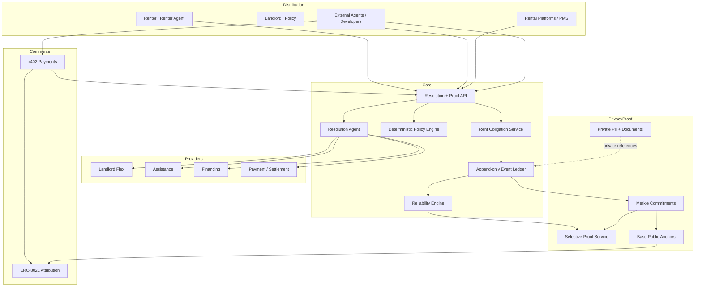

# Rent Resilience Network

> **Rent should compound into financial resilience.**

Agentic infrastructure for resolving housing obligations and turning verified rent history
into portable, privacy-preserving financial resilience — built on Base.

A renter who has satisfied tens of thousands of dollars of rent obligations should not be
treated as an unknown applicant the first month something goes wrong. Rent Resilience
represents rent as a verifiable obligation, keeps private renter/landlord facts offchain,
publishes cryptographic evidence without exposing PII, and lets agents discover and
compose payment flexibility, assistance, and financing — preferring the least harmful
resolution path ("borrow last").

**This is not "crypto rent payments."** Payment is one resolution mechanism, not the product.

## Status

Pre-MVP. Protocol schemas are published; the ledger, policy engine, resolution agent,
proof service, and x402 endpoints are in active development. See the
[roadmap](docs/roadmap-architecture.md) and the site at
[rent.kylebrodeur.xyz](https://rent.kylebrodeur.xyz).

## What exists today

- [`RentObligation` v0.1 schema](packages/protocol/schemas/rent-obligation.v0.1.schema.json)
- [`RentEvent` v0.1 schema](packages/protocol/schemas/rent-event.v0.1.schema.json)
- [Protocol specification](docs/protocol.md) — invariants, state transitions, reliability
  derivation, canonicalization and Base anchoring design
- [Product research](docs/research.md) · [Roadmap & architecture](docs/roadmap-architecture.md) ·
  [Base / x402 commercialization](docs/base-x402-monetization.md)

## Architecture in one view

## Principles

1. Rent should compound into resilience.
2. Private facts. Public proofs. Portable trust.
3. The renter controls disclosure of their history.
4. Assistance does not erase reliability.
5. Borrow last.
6. Agents orchestrate; explicit policy decides.
7. No silent ledger rewrites.
8. Use the cheapest appropriate settlement rail.
9. Do not tokenize something merely because crypto is available.
10. Earn the blockchain before operating one.

## First commercial milestone

> An external agent discovers a Rent Resilience API capability, pays for it in USDC over
> x402, and receives a useful verified result without manual intervention.

## License

[MIT](LICENSE)
