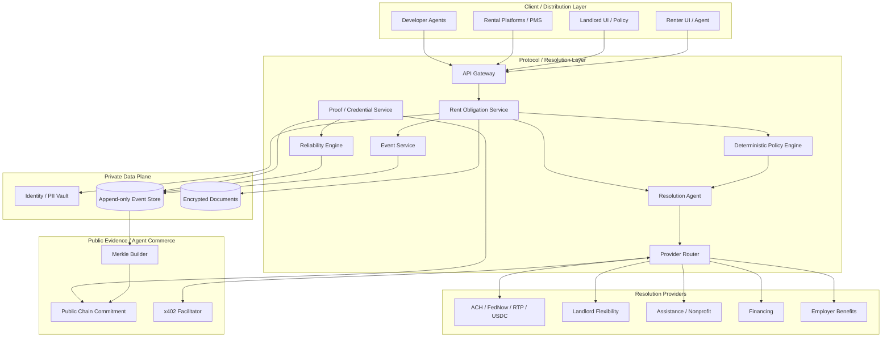
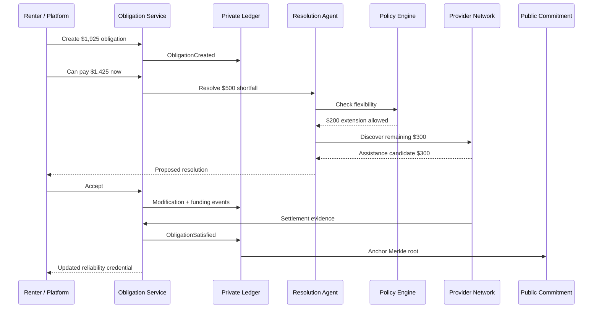
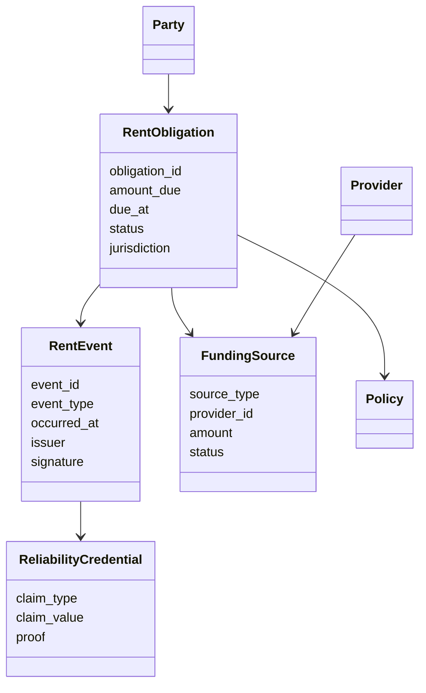
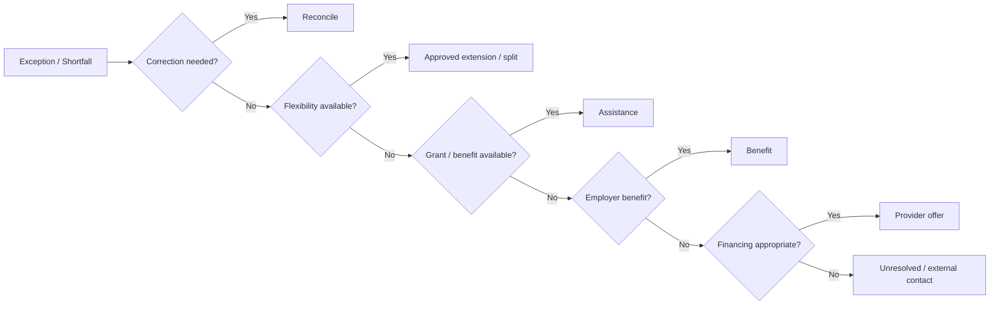
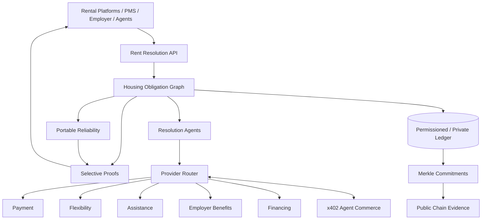

# Rent Resilience Network — Proposed Roadmap & Architecture

**Date:** September 6, 2026  
**Goal:** Reach a sellable developer product quickly while preserving a path to a multi-party housing-resolution network.

## Product statement

> **A protocol and agent network that turns rent obligations into verifiable, resolvable objects—and turns reliable rent history into portable financial resilience.**

The first product is infrastructure, not a consumer neobank, lender, charity, or replacement PMS.

## Architectural principles

- Private facts; public proofs.
- Event-sourced obligation ledger.
- PII separated from protocol identity.
- Agents interpret/orchestrate; deterministic policy decides.
- Providers retain authority over grants, lending, settlement, and eligibility.
- x402 pays for machine services/proofs, not necessarily rent itself.
- Payment rails are adapters: ACH, FedNow/RTP, stablecoins, or existing platform rails.
- Assistance does not reset renter reliability.
- No proprietary token in MVP.
- Start centralized but cryptographically auditable; decentralize governance only when institutions need it.

## System architecture



The **private plane** contains rental facts. The **public plane** contains commitments/proofs only. Provider integrations receive only authorized, necessary data/proofs.

## Core event flow



## Core domain model



## Resolution priority



Default principle: **borrow last**, while preserving renter choice and provider rules.

# Roadmap

## Phase 0 — Specification and economic simulator
**Target:** 3–5 days  
**Goal:** Freeze the smallest protocol before UI work.

Deliverables:
- `RentObligation` JSON Schema
- `RentEvent` JSON Schema
- provider capability schema
- deterministic policy schema
- reliability calculation specification
- canonical serialization/signature rules
- synthetic dataset: 100 renters × 24 months
- scenarios: on-time, approved late, assistance, failed payment, correction, multi-source resolution
- resilience economics simulator

Exit criteria: any obligation reconstructs entirely from events; assistance does not destroy historical reliability; no PII is required in protocol events; reliability claims reproduce deterministically.

## Phase 1 — Ledger + reliability MVP
**Target:** Week 1

Build:
- TypeScript API
- Postgres/Supabase append-only event store
- event signing
- derived obligation state
- reliability engine
- renter timeline + landlord obligation view

Suggested API:
```text
POST /v1/obligations
POST /v1/obligations/:id/events
GET  /v1/obligations/:id
GET  /v1/parties/:id/reliability
POST /v1/proofs
```

Exit: demonstrate 24 months of history and a month-25 shortfall without mutating prior records.

## Phase 2 — Resolution engine
**Target:** Week 2

Build:
- natural-language request → structured proposal agent
- deterministic landlord policy engine
- provider registry
- sandbox flexibility, assistance, and financing adapters
- resolution router
- offer comparison/explanation
- accept/decline/expire/settle state machine

Exit: “I can pay $1,200 now and $725 Friday” becomes a deterministic proposal; in-policy requests auto-resolve; out-of-policy requests never invent approval; multi-source sandbox resolution works.

## Phase 3 — Public evidence + x402
**Target:** Week 3

Build:
- canonical event hashing
- Merkle batches
- testnet root anchoring
- inclusion proof endpoint
- minimum-disclosure credential API
- x402 payment on one low-risk developer endpoint
- API usage accounting

Example:
```text
GET /v1/proofs/payment-history/:credential
→ HTTP 402
→ agent pays USDC
→ authorization checked
→ proof returned
```

Exit: changing an old event breaks verification; public chain contains no PII; another agent can pay for and verify a sandbox proof.

## Phase 4 — Sellable developer preview
**Target:** Week 4

Ship:
- public docs
- hosted sandbox
- TypeScript SDK
- demo application
- provider-adapter template
- five-minute integration walkthrough
- basic usage dashboard
- founding design-partner offer

Commercial tests: paid integration/setup pilot, small platform minimum, or x402/pay-per-proof usage.

Target customers: small rent-tech startups, small PMS vendors, housing-assistance software vendors, fintech/agent developers. **Do not start with Apartments.com procurement.**

## Phase 5 — First real-data pilot
**Target:** Months 2–3

One partner; read-only/imported rent records; renter consent; obligation creation; payment-event reconciliation; reliability credentials; resolution recommendations without initially moving funds.

Measure record accuracy, automatic reconciliation, proof issuance, resolution opportunities, partner engineering time, and user comprehension.

Gate before real payments: legal review, security/privacy review, dispute/correction procedure, issuer trust model, and retention policy.

## Phase 6 — Payment adapter pilot
**Target:** Months 3–5

Add real settlement through an approved provider rather than becoming the money transmitter by default.

Evaluate ACH, FedNow/RTP through partners, USDC/stablecoin orchestration, and existing PMS payment confirmation separately.

Selection rule: **use the cheapest appropriate rail that satisfies settlement, reversibility, compliance, and UX requirements.** Do not assume crypto wins domestic bank-to-bank rent.

## Phase 7 — Assistance-provider pilot
**Target:** Months 4–6

Requirements:
- nonprofit/fiscal-sponsor partner
- machine-readable eligibility requirements
- renter-authorized proof bundle
- program retains grant authority
- commitment/settlement adapter
- no donor selection of individual renter for deductible gifts

Measure application time, manual-document reduction, decision time, funding time, and resolved-rent dollars.

## Phase 8 — Resilience economics pilot
**Target:** Months 6–9

Start with **sponsored benefits**, not guaranteed insurance-like payouts.

Test:
- $1–$3 platform-sponsored contribution equivalent per successful obligation
- reliability tiers
- assistance-discovery unlocks
- fee discounts
- faster verification
- landlord flexibility benefits

Do not represent credits as cash balances unless legally structured as such.

## Phase 9 — Platform embedding
**Target:** Months 9–18

Enterprise package:
- Resolution API
- Reliability/Proof API
- provider router
- white-label UI components
- audit/proof service
- provider adapters
- SLA/observability
- enterprise privacy controls

Pitch:
> **You already know what is owed and what has been paid. We resolve the exceptions and turn successful payment history into portable renter resilience.**

Before approaching a major platform, have evidence for real obligations processed, automatic-resolution rate, resolved-rent dollars, time-to-resolution improvement, integration effort, provider coverage, privacy/security, and unit economics.

## Phase 10 — Multi-party permissioned ledger
**Target:** Only after multiple institutional participants require shared governance.

Trigger conditions:
- 3+ independent organizations issue canonical events;
- no single operator should control history;
- shared consensus materially improves trust/operations;
- governance, node operation, recovery, and dispute rules exist.

The public chain remains a **proof/commitment layer**, never a PII database.

## Solo-founder priority stack

### P0 — Must exist
1. obligation/event schemas
2. event store
3. reliability derivation
4. deterministic policy engine
5. resolution provider interface
6. sandbox resolution agent
7. cryptographic proof
8. developer demo

### P1 — Makes it sellable
1. x402 paid proof
2. SDK/docs
3. provider adapter template
4. hosted sandbox
5. basic usage analytics
6. integration-pilot process

### P2 — Requires partners
1. real payment adapter
2. nonprofit assistance adapter
3. employer benefit adapter
4. real stablecoin settlement
5. credit reporting

### P3 — Scale architecture
1. permissioned blockchain
2. advanced selective/ZK proofs
3. multi-platform provider marketplace
4. enterprise control plane/SLA
5. advanced risk/allocator models

## Suggested technical stack

Keep the first version boring:

```text
Runtime/API:        TypeScript / Node
API framework:      Fastify, Hono, or equivalent
Database:           Postgres / Supabase
Schema validation:  JSON Schema + runtime validation
Jobs/events:        Postgres queue initially
Agent layer:        model-agnostic tool-calling orchestration
Policy:             deterministic TypeScript rules / JSON policy docs
Crypto signing:     standard audited libraries
Merkle/proofs:      standard hash + Merkle implementation
Public anchor:      inexpensive EVM L2 testnet first
x402:               official/current SDK/facilitator path
Observability:      OpenTelemetry
```

Avoid Kafka, a graph database, Kubernetes, custom consensus, or multiple agent frameworks until actual requirements justify them.

## Repository shape

```text
/apps
  /demo-web
  /docs
/services
  /api
  /agent
/packages
  /protocol
  /events
  /policy
  /reliability
  /proofs
  /provider-sdk
  /x402
/adapters
  /sandbox-flexibility
  /sandbox-assistance
  /sandbox-financing
  /payments-sandbox
/simulations
  /rent-history
  /resilience-economics
/docs
  architecture.md
  protocol.md
  threat-model.md
  provider-spec.md
  compliance-boundaries.md
```

## First demo story

The demo should communicate the whole company in under three minutes:

1. Renter has 24 months of independently satisfied $1,925 obligations.
2. Reliability engine produces a privacy-preserving 24-month credential.
3. Month 25 renter can pay only $1,425.
4. Agent detects a $500 shortfall.
5. Landlord policy automatically permits $200 later.
6. Assistance sandbox can cover $300.
7. Renter accepts the composition.
8. Obligation becomes satisfied through multiple sources.
9. History becomes 25/25 satisfied, 24 independently funded, 1 assisted.
10. Merkle root is publicly anchored.
11. External agent pays via x402 to verify a minimum-disclosure claim.

This demo requires **no real rent, lending, charity, or custody**.

## Commercial milestones

### A — Someone integrates the sandbox
External developer sends real API calls.

### B — Someone pays
Paid design partner, setup fee, API minimum, or x402 usage.

### C — Real rent records
Partner imports/streams genuine obligations with renter authorization.

### D — Real resolution
A partner uses the protocol to resolve an actual exception.

### E — Real capital provider
A regulated/authorized provider funds or settles through an adapter.

### F — Embedded distribution
A rental platform exposes the capability inside its own UI.

## What not to optimize for yet

- token price
- TVL
- chain transaction count
- number of agents
- consumer app downloads
- number of smart contracts
- vanity “AI” features

Optimize for:

> **Verified obligations → automatically resolved obligations → dollars of rent resolved → lower cost/harm per resolution.**

## Immediate next 10 tasks

1. Choose a working project/repository name.
2. Write `RentObligation v0.1` schema.
3. Write `RentEvent v0.1` schema and state-transition table.
4. Define reliability claims and exact derivation rules.
5. Generate the 100-renter synthetic history dataset.
6. Build the deterministic landlord-policy evaluator.
7. Define `ResolutionProvider v0.1` interface.
8. Implement three sandbox providers.
9. Build Merkle commitment/proof prototype.
10. Build the 24-good-months → $500-shortfall demo before adding production integrations.

## Decision gates

**Gate 1 — Is the primitive useful?** External developer understands and uses it. If not, simplify schemas/API.

**Gate 2 — Is resolution valuable?** A partner wants resolution in addition to ledger/proofs. If not, proof/reliability infrastructure may be the standalone product.

**Gate 3 — Does x402 add value?** Agents actually pay for proofs/services. If not, retain ordinary API billing; x402 remains optional.

**Gate 4 — Do stablecoins improve a real flow?** Compare real all-in cost/speed against ACH/FedNow/RTP. If not, don't force crypto into rent settlement.

**Gate 5 — Is shared ledger governance necessary?** Only deploy permissioned consensus when multiple independent issuers require it.

## End-state architecture



The moat is not the blockchain, x402, or the model. It is the **housing obligation graph plus trusted provider network and portable evidence accumulated around it**.
